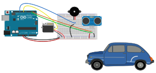

# Telepass

Questa attività utilizza le seguenti risorse:

* **[sensore di prossimità](../parking)** (per rilevare la presenza di un veicolo)
* **cicalina piezoelettrica** (per emettere un segnale acustico all'inizio e al termine del processo)
* **servomotore** (per alzare e abbassare la sbarra, costituita da una cannuccia).

## Schema di montaggio

Nello schema sovrastante, viene mostrato lo schema di montaggio per l'utilizzo del codice [telepass](telepass/telepass.ino).

Per la corretta comprensione di questo progetto è bene aver chiaro il funzionamento del **sensore di prossimità** e del **servomotore**.

## Pseudocodifica

* Il dispositivo rimane in attesa, finché il **sensore di prossimità** non rileva un oggetto a distanza compresa tra $2~\text{cm}$ e  $6~\text{cm}$.
* Quando questa condizione è soddisfatta, la **cicalina** emette un _beep_ a $440~\text{Hz}$ per $400~\text{ms}$.
* Dopodiché, il **servomotore** passa dall'inclinazione pari a $0^\circ$ a $90^\circ$. Per ogni grado vi è un'attesa di $15~\text{ms}$, pertanto il processo dura $1,35~\text{s}$.
* A questo punto l'automobile può entrare e vi è un tempo di attesa di $3~\text{s}$.
* Prima di abbassare la sbarra, la **cicalina** emette un _beep_ a $220~\text{Hz}$ per $400~\text{ms}$.
* Infine, il **servomotore** riporta l'inclinazione della sbarra da a $90^\circ$ a $0^\circ$. Questo processo, come il precedente, dura $1,35~\text{s}$.
* L'ultimo passo è un'attesa di $50~\text{ms}$ prima di verificare la presenza di un altro veicolo, attesa funzionale a ridurre il consumo energetico del dispositivo.

## Risultato in laboratorio

