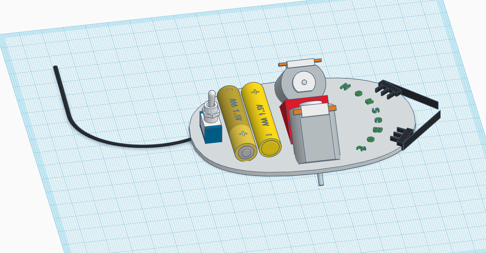

# MouseBot: il mouse prende vita

Per vedere il proprio topo (okay, okay: _mouse_) prendere vita è sufficiente svuotarlo di tutto (tranne dieci centrimetri di filo, che diventeranno una bellissima coda) e seguire le istruzioni riportate in questo schema di montaggio:

  

## Idea di base

Tramite due motori, che verranno posizionati a $90^\circ$ l'uno dall'altro, come mostrato in figura.

**Attenzione** I due motori verranno alimentati da una batteria soltanto. Come visibile dallo schema elettrico, le due batterie sono connesse in serie e il terminale centrale e connesso a entrambi i motori.

Se i _baffi_, dei comuni SPDT (ovvero switch _single-pole double-throw_) con un terminale **comune** (connesso all'altro capo del motore) e altri due
terminali:

* quello **normalmente chiuso** connesso alla batteria con segno $+$;
* quello **normalmente aperto** (chiuso solo quando il _baffo_ urta un ostacolo) connesso alla batteria con segno $-$.

Così facendo, il MouseBot avanzerà sempre, tranne quando urterà un ostacolo:

* se lo urta a **sinistra** il motore a sinistra verrà connesso a una tensione negativa, pertanto andrà in retromarcia, provocando una rotazione in senso
orario;
* viceversa, se è il _baffo_ **destro** a urtare qualcosa, il motore destro verrà alimentato con una tensione negativa e, la sua retromarcia, provocherà
una rotazione in senso antiorario;
* infine, in caso di urto **frontale** entrambi i motori verranno alimentati con una tensione negativa e il MouseBot andrà in retromarcia.

In ogni caso, la guida autonoma consente al MouseBot di divincolarsi da qualsiasi ostacolo con due eccezioni:

* divani o spazi troppo bassi;
* e, naturalmente, scale...

## Problemi energetici

Il mouse e quello che vi è contenuto è estremamente leggero, pertanto non sarà un problema alimentare i due motori con una singola batteria. Certo, si sarebbe potuto risolvere la questione con un [ponte ad H](https://it.wikipedia.org/wiki/H-bridge), ma si è pensato di procedere così per utilizzare un numero davvero esiguo di componenti.

Una soluzione a questo problema è invertire la posizione delle due batterie dopo l'utilizzo, dal momento che la batteria connessa ai motori viene utilizzata per la **marcia**, mentre l'altra solo per le **manovre** (svolta a sinistra, svolta a destra e retromarcia).

Modello tridimensionale
##

Una  è disponibile qui. Non è stata pensata per essere stampata, ma per fornire un'idea del prodotto finito.
